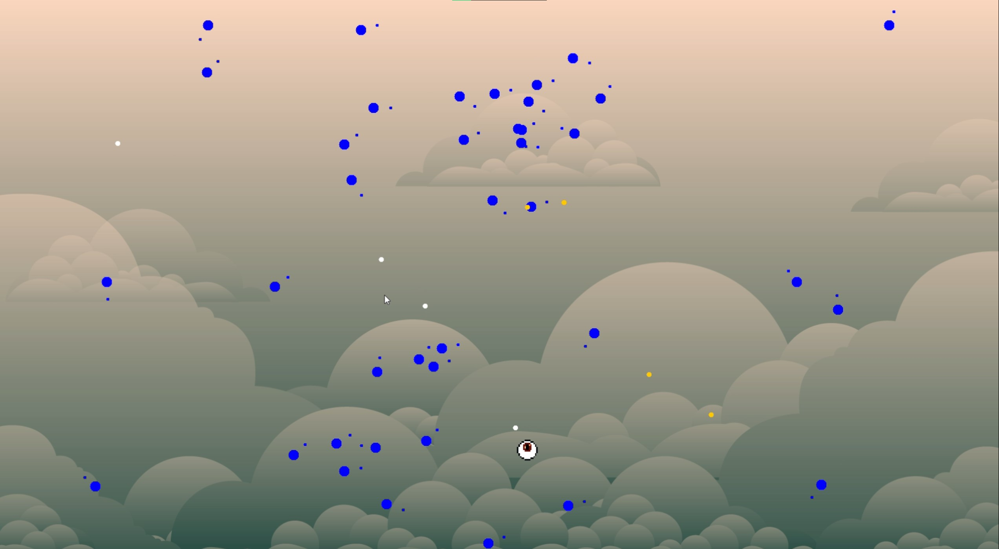
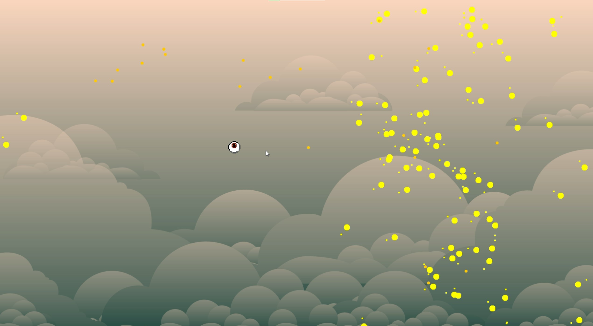
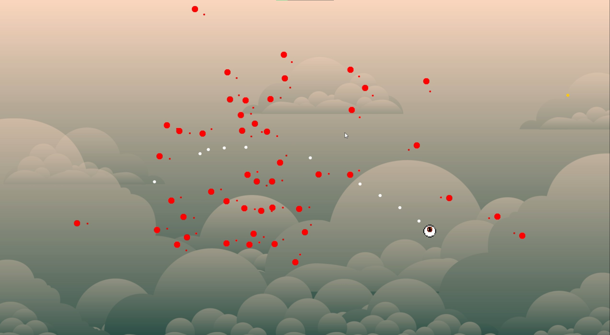
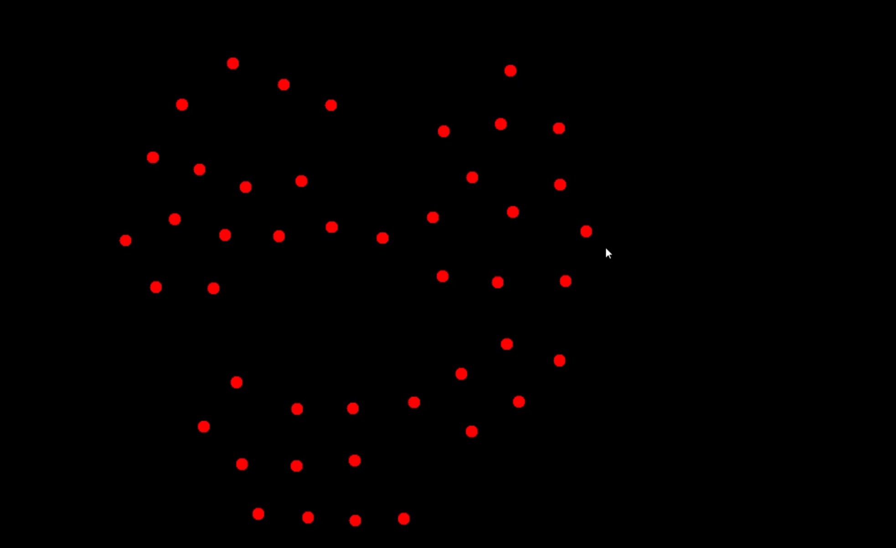
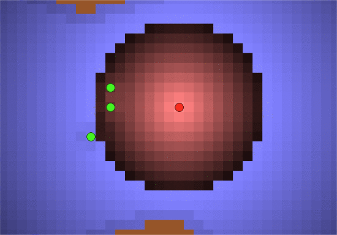

# Tobias Moszer's Flocking Shooter

## Features

The video submission part of this project can be found [here](https://www.youtube.com/watch?v=1lOUWAHI3Wg).

### Overall mechanics

The objective of this game is to eliminate the entire flock without getting hit by any members of the flock,
or any of the flock's projectiles.
The only way to eliminate a member of the flock is to hit it with your own projectile.
The player cannot hit itself with its own projectile,
and one flock member cannot hit another flock member with the flock's projectiles.
The player's projectiles are always white, and the flock's projectiles are always orange.

When the player's projectile hits a flock member,
that member is deleted along with the projectile.
When the flock loses members,
the overall output of projectiles from the flock remains the same.
To accomplish this, each flock member shoots more projectiles on average.

When members of the flock reach the edge of the screen,
they are transferred over to the opposite side of the screen.
This keeps the player in the center of attention,
so the player can't really keep the whole flock on one side of them the whole time.
This behavior is only available to the flock,
so the player cannot easily get out of tough situations by just going off the screen.

### Flocking Behaviors

The flock has 3 distinct behavior types,
all represented by the color of the flock.

When the flock is blue,
it does not care about the player's position when determining its own movement.
It is also allowed to shoot a moderate number of projectiles.

When the flock is yellow,
it actively tries to avoid the player.
Any time a member of the flock gets within a certain radius of the player,
an extra force applies to the member to push it away.
The flock is also able to shoot many more projectiles in this state.

When the flock is red,
it will attempt to swarm the player.
The movement speed of the flock is increased,
but it is no longer able to shoot any projectiles.

## Algorithms and Approaches

Boids is used for all flocking behavior.
In addition to the 3 main boids forces,
an extra force is added in some situations to either push the boids toward the player 
or away from the player.
There is a small dot in front of every boid to show which direction that boid is currently traveling.
This project expands on the basics of force based interactions covered in class.

All code (except for the core of the [Vector2](src/game/vectors/Vector2.java) library) is written exclusively by me in Java,
using the built-in default graphics (no [processing](https://processing.org/)).
I modified and added to the [Vector2](src/game/vectors/Vector2.java) library a bit to better suit this project.

## Difficulties Encountered

Tweaking the flocking behavior to feel natural took a lot of time.
It was rigid and grid-like after my first implementation.

This is what the original flock looked like:

I had to make some code changes
as well as just adjusting weights and radii to make it better.
I still feel like it could be improved a bit,
but it is in a way better spot now than it was originally.

A lot of time was spent on these tweaks,
and I was working on my [CSCI 5619 Final Project](https://www.youtube.com/watch?v=8qc9OyWq3e0)
at the same time, which creates a virtual environment for tuning boids behavior.
This utility was really useful for getting some good relative relationships between the boid forces,
and although it didn't translate to 2D perfectly,
it was better than trying random values.

## Feedback

I had a lot of good feedback from the progress report,
and the big 3 things that were commented on were as follows:

1. The boids look very grid-like
2. A background would improve the visuals drastically.
3. Utilization of sprites would be a good touch.

I had already planned on implementing all of these features,
and I got around to implementing at least the better part of them.

The grid-like appearance of the flock is already discussed in the
[Difficulties Encountered section](#difficulties-encountered).

I'm no artist,
so finding sprites on the web was really the only option for getting them into the game.
This proved difficult,
and finding different enough sprites to represent
the flock's different behaviors was not worth the time needed.

## Relationship with related work

Boids is still being used and adapted today.
[This article](https://citeseerx.ist.psu.edu/viewdoc/download?doi=10.1.1.1062.9422&rep=rep1&type=pdf)
goes over some optimization techniques for the original boids algorithm.
With boids being such an adaptable concept, it can be molded to fit so many use cases.
Boids can be applied to most modern research in pathfinding, crowd simulation,
and other related topics.

In [this paper about hybrid pathfinding](https://ieeexplore.ieee.org/abstract/document/7063238),
there is a section about hybrid navigation systems.
The idea that certain locations can hold a property that affects the forces of
force based interactions is an idea I referenced for this project.

This image of a potential field from the above paper on hybrid pathfinding gives 
a perfect example of what is happening around the player during the yellow avoid behavior of the flock.
When the flock members get close enough to the player and enter this field,
an extra force is applied to keep them away from the player.

## Future work

There are many options for where this project could go in the future.
Adding more flock behavior types is an obvious one.
Adding some kind of level system would also be cool,
with levels getting more difficult as you go.
I thought about adding an ability for the flock to summon in more members,
but I couldn't really think of a good way to trigger that kind of behavior.
A health system would also benefit this game,
so that you don't have to start over if you get hit just once by the flock.

The big challenge I immediately see when thinking about scaling this project up is
maintaining the boids behavior in the flock.
When adding new behaviors,
maintaining a consistent feel is important.
The flock size also has an effect on the overall behavior,
so it would be important to keep this in mind when implementing something like
a level system where flocks start smaller and grow as the levels progress.

Multiple independent flocks would also be an interesting addition.
Would these flocks interact with each other?
Would these flocks be able to work together at all?
This also opens the door for level layouts with multiple rooms,
with different flocks in each room.
Maybe some flocks can have better spacial awareness,
and others can shoot bouncing projectiles but have very limited movement.
There could be barriers that allow the player to pass through,
but no projectiles or flock members are allowed through.
This could be a way to divide levels into different sections even further.

## Resources Used

* http://pixelartmaker.com/art/44b65f9c4057ff8
* https://pressstart.vip/assets
